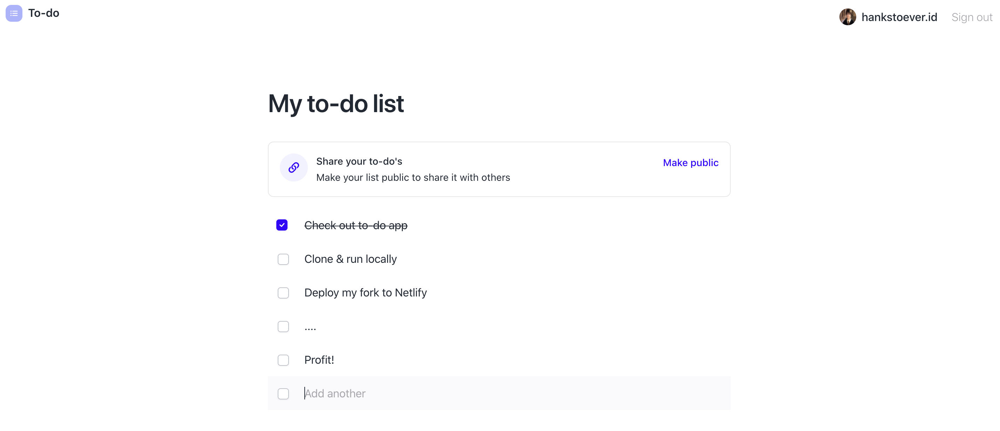

# Stacks-app

Learning how to interact with blockstack auth, smart contract and Gaia. 



## Usage

``` bash
# install dependencies
npm install

# Compiles and hot-reloads for development
npm run start

# Compiles and minifies for production
npm run build
```
